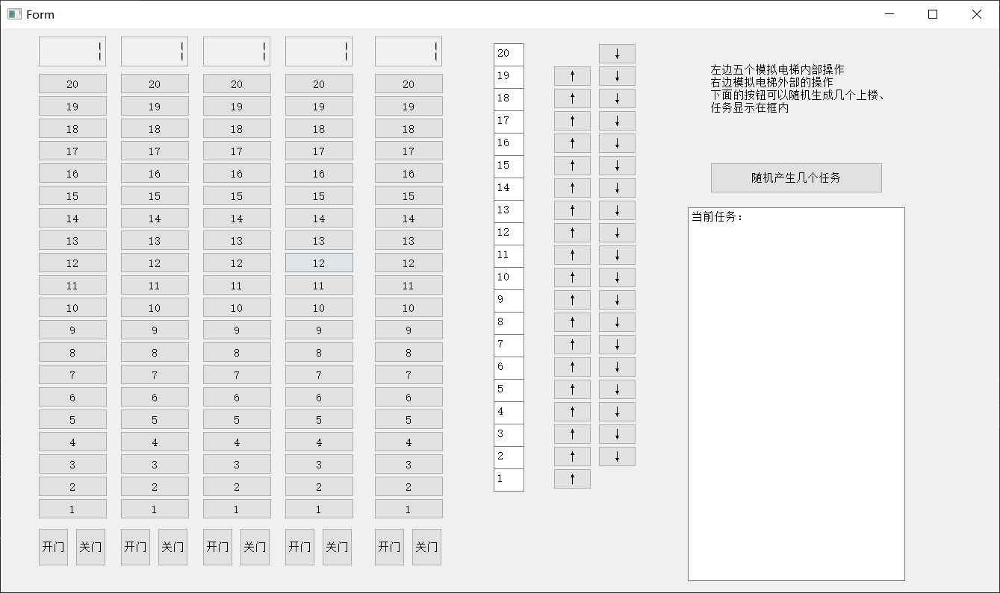
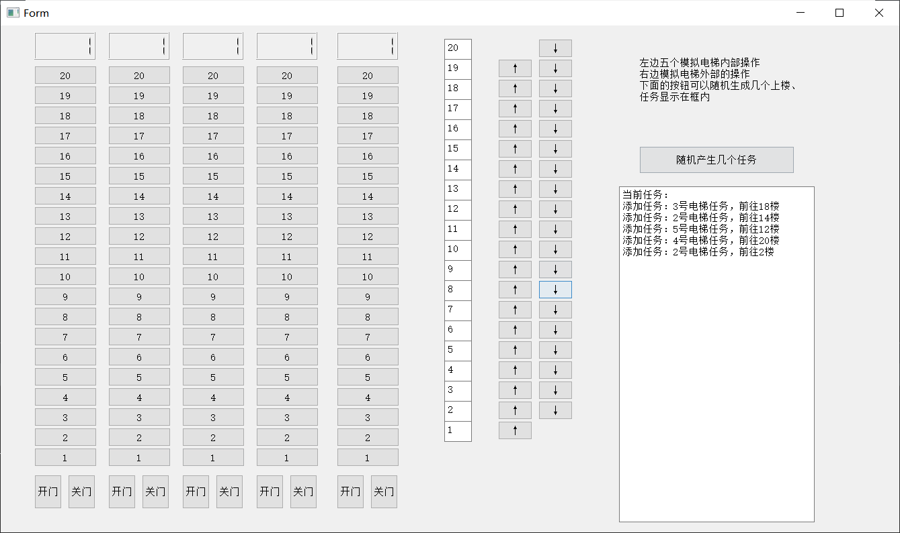
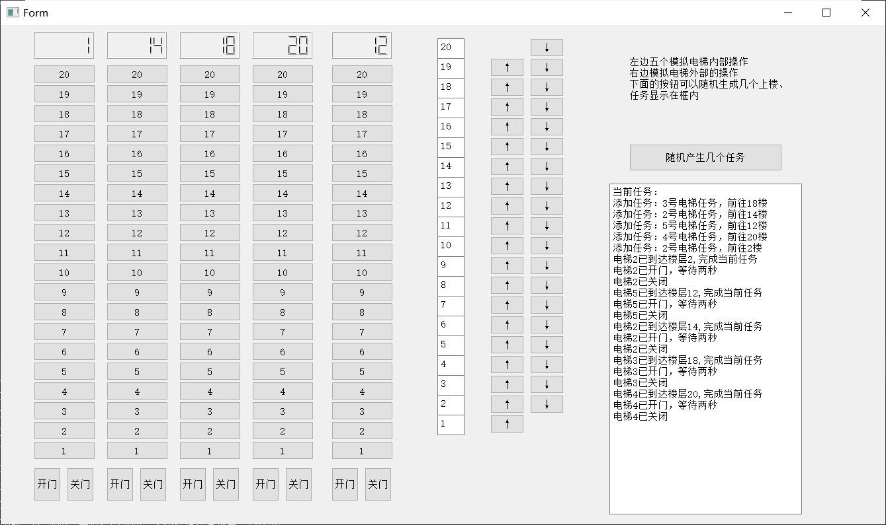
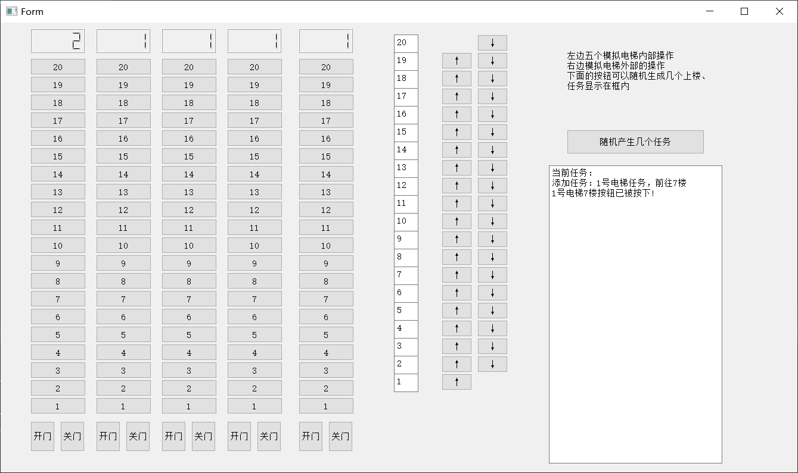

# 电梯调度设计报告

## 项目说明

本项目通过模拟调度高度为20层的5座电梯，以实现操作系统调度过程，并且掌握一定的多线程编程方法，同时学习一部分调度算法。项目通过PyQt5实现图形化界面，以加强可视性

## 项目界面

* 项目左侧的五列按钮代表五台电梯内的按钮；按钮上方的显示屏代表电梯当前的层数。下方的“开门”，“关门”按钮代表当前
* 右侧的“↑”，“↓”按钮代表电梯外部该楼层的控制按钮。
* 右侧按钮“随机产生几个任务”可以随机产生五个电梯内部任务与电梯外部任务（其中外部任务与每个电梯内部任务产生的概率都为16.7%）
* 右上角为项目简要说明
* 右下角为任务状态输出，输出生成的任务信息

## 项目功能

* 按下数字键后电梯就会添加到达指定楼层的任务
* 按下上下键后会给其中一个电梯到达指定楼层的任务
* 当电梯处于等待状态时，按下开门键可以让电梯“开门”，按下关门键可以让电梯“关门”。具体信息会在任务列表变化中显现出来
* 点击“随机产生几个任务”可以模拟有几个乘客向系统发送任务
* 右侧具有项目提示栏提示各个电梯的任务日志以及每个电梯添加的任务
* 上方的显示板记录了当前电梯所在的楼层

## 项目环境

* 开发环境
  * 系统：Windows 10 家庭中文版
  * IDE： PyCharm Community Edition 2022.1
  * python 解释器版本：Python 3.10

* 运行方式
  
  * 首先确保betterElavator.py和ui_ElevatorDesign.py在同一路径下
  
  * 可以使用pycharm打开项目文件夹中的betterElavator.py文件。在安装PyQt5包，配置好解释器环境与其他必要的组件后即可正确运行
  
    或者
  
  * 编译运行
  
    * 安装python3.10或以上版本
  
    * 安装PyQt5
  
      ```bash
      pip install PyQt5
      ```
  
    * 在cmd下运行源码
  
      ```bash
      python betterElavator.py
      ```
  

## 项目设计

* 并行算法设计

  * 本项目将五台电梯分别作为五个线程进行运行。五台电梯分别拥有自己的任务池，同时都可以访问外部楼层的任务池。为了避免并发导致的对共享内存读写冲突，本项目使用互斥锁对共享任务池进行保护，同时采取了生产者-消费者的设计模式合理调度外部任务池。
    * 外部任务池的数据结构为队列，作为生产者-消费者的管理管道
    * 外部乘客作为生产者创造命令。当按下外部按钮时向队列内添加任务
    * 电梯作为消费者执行命令，每个电梯轮询外部任务池，若任务池内有任务且任务要求的方向运行方向与电梯方向一致，则电梯从任务池中获取任务
  * 为了避免电梯线程同时访问队列中的相同元素，项目设计了一个互斥锁，当某一个电梯线程访问队列时，其他线程将无法访问该队列。

* 电梯调度算法

  一般有如下算法：

  * **先来先服务算法（FCFS）**。该算法根据乘坐电梯的先后次序调度，虽然公平、简单，但是一旦载荷较大，就会严重增加等待时间
  * **最短寻找楼层时间优先算法（SSTF）**。该算法每次寻找可以最快满足的楼层，这样可以减少等待时间，但部分楼层（如顶楼和1楼）可能长时间无法响应，出现类似于操作系统中“饥饿”（starvation）的现象
  * **扫描算法（SCAN）**。该算法使电梯在最底层和最顶层之间连续往返，所有方向相同的请求在一趟中完成，以确保总体等待时间的稳定。
  * **LOOK 算法**。该算法对扫描算法改进，当电梯发现移动方向上不再有目标时立即改变方向。

​		本项目采取先来先服务算法，以简化问题的解决

* 类设计

  * 为了实现代码的更好的复用，对于解决电梯调度的问题，本项目设计了三个类:Elevator，Floor和ElevatorScheduler。
  
    * Elevator类用于定义电梯的任务列表以及一些电梯的原子操作（包括向上运行，向下运行，开门，关门）；
    * Floor类用于定义外部楼层的操作（包括定义在外部楼层按向下按钮，在外部楼层按向下按钮）
    * ElevatorScheduler类用于定义对五个电梯的调度方法以及定义处理外部楼层操作有关的生产者-消费者队列
  
    Elevator类部分函数：
  
    | 函数                           | 作用                                           |
    | ------------------------------ | ---------------------------------------------- |
    | open_door（）                  | 电梯开门的原子操作                             |
    | close_door（）                 | 电梯关门的原子操作                             |
    | go_up（）                      | 电梯上行的原子操作                             |
    | go_down（）                    | 电梯下行的原子操作                             |
    | add_floor_to_queue（int）      | 添加指定楼层到该电梯任务队列，参数为指定的楼层 |
    | remove_floor_from_queue（int） | 从电梯任务队列中删除指定楼层，参数为指定的楼层 |

    Floor类部分函数：

    | 函数             | 作用                 |
    | ---------------- | :------------------- |
    | print_status（） | 打印当前楼层         |
    | UpButOn（）      | 模拟按下上楼按钮     |
    | UpButOff（）     | 模拟上楼楼梯按钮熄灭 |
    | DownButOff（）   | 模拟下楼楼梯熄灭     |
    | DownButOn（）    | 模拟按下下楼楼梯     |
    
    ElevatorScheduler类的部分函数：
    | 函数                               | 作用                                                         |
    | ---------------------------------- | ------------------------------------------------------------ |
    | start（）                          | 启动电梯线程                                                 |
    | AddMissionRandomly（int）          | 随机添加几个任务，参数为添加的任务个数                       |
    | OuterOrder（floornum，option）     | 添加外部请求，floornum指几楼提出的请求，option控制上楼还是下楼 |
    | InnerOrder（elevatorID，floornum） | 添加电梯内部请求，elevatorID选择几号电梯，floornum指定要到达的楼层 |
    | elevator_thread（elevator）        | 电梯线程函数，elevator参数指启动五台电梯中的几号电梯         |

* 调度算法：
  * 对于外部任务，选择一个和请求的方向相同的电梯，将到达该楼层的任务添加到该电梯任务列表里。
  * 对于内部任务，直接将请求添加到电梯任务列表里。
  * 电梯每次从任务列表里取出第一个任务，每次执行完任务后再取出下一个任务

## 项目总结

* 前端元素有很多的时候可以用打表的方式存在list里，通过访问list与正则表达式抽取指定对象名与变量
* python的queue是线程安全的，但它的互斥方法是挂起进程，所以获取元素时还是需要自定义锁+无阻塞读取，否则当外部任务为空时会直接中断电梯线程
* 合理的assert与log可以让并行bug更容易复现
* 在边界区要上好锁避免并行冲突，但是不能上过多的锁，防止某个锁长时间持有锁甚至挂起导致整个程序退化至单线程甚至停止运行

## 运行截图

启动程序后的界面：



随机产生几个任务：



执行五个任务到完成：



点击按钮添加任务：



